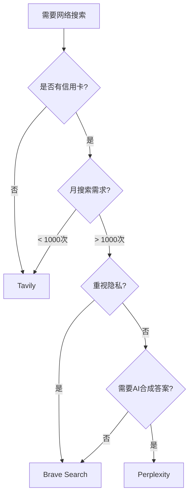
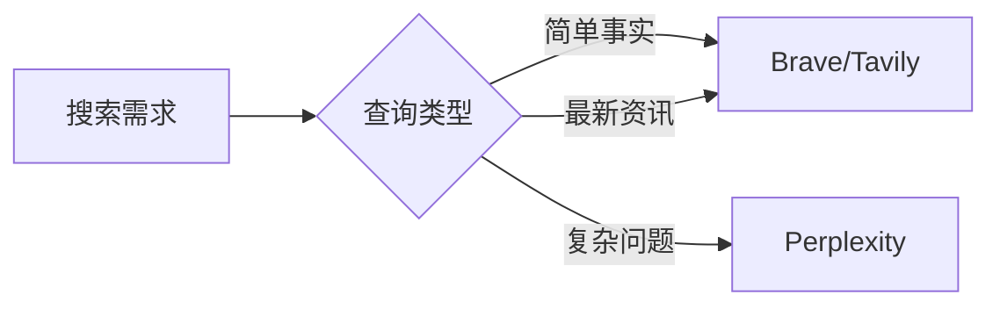

# OpenClaw Web Tools 完全指南

[**English**](web-tools-guide.md) | [**简体中文**](web-tools-guide-zh.md)

---

## 目录

- [概述](#概述)
- [快速开始](#快速开始)
- [搜索引擎对比](#搜索引擎对比)
- [Brave Search 配置](#brave-search-配置)
- [Tavily 配置](#tavily-配置)
- [Perplexity Sonar 配置](#perplexity-sonar-配置)
- [web_fetch 网页抓取](#web_fetch-网页抓取)
- [常见问题](#常见问题)
- [最佳实践](#最佳实践)

---

## 概述

OpenClaw 内置了两个轻量级 Web 工具：

| 工具 | 功能 | 适用场景 |
|------|------|----------|
| **web_search** | 网络搜索 | 获取最新信息、资料查找 |
| **web_fetch** | 网页抓取 | 提取网页正文内容 |

> [WARN] **注意**：这些工具**不是**浏览器自动化。对于需要执行 JavaScript 或登录的网站，请使用 Browser 工具。

### 工作原理

```
┌─────────────────┐     ┌─────────────────┐     ┌─────────────────┐
│   Your Query    │────▶│   web_search    │────▶│  Search API     │
│  "最新 AI 新闻" │     │   (Search)      │     │  (Brave/Tavily) │
└─────────────────┘     └─────────────────┘     └─────────────────┘
                                                              │
                                                              ▼
┌─────────────────┐     ┌─────────────────┐     ┌─────────────────┐
│  Readable       │◀────│   web_fetch     │◀────│  Search Results │
│  Content        │     │   (Fetch)       │     │  (URLs + Snippets)│
└─────────────────┘     └─────────────────┘     └─────────────────┘
```

**结果缓存**：搜索结果默认缓存 15 分钟（可配置），减少重复请求。

---

## 搜索引擎对比

### 快速决策表

| 特性 | **Brave Search** | **Tavily** | **Perplexity** |
|------|------------------|------------|----------------|
| **免费额度** | 2000次/月 | 1000次/月 | 按量付费 |
| **需信用卡** | [PASS] 是 | [FAIL] 否 | [PASS] 是 |
| **响应速度** | 快 | 更快 | 中等 |
| **结果格式** | 结构化 (title+URL+snippet) | AI优化结构化 | AI合成答案 |
| **隐私保护** |  最强 |  |  |
| **AI优化** | 传统搜索 | 专为AI设计 | AI原生 |
| **注册难度** | 需绑卡 | 邮箱即用 | 需绑卡 |
| **推荐场景** | 高频使用、隐私敏感 | 轻度使用、快速部署 | 深度研究 |

### 选择建议



### 详细对比

#### Brave Search - 隐私优先的选择

```
[PASS] 优点:
   • 免费额度最高 (2000次/月)
   • 强大的隐私保护
   • 结构化结果易于解析
   • 官方默认支持

[FAIL] 缺点:
   • 必须绑定信用卡
   • 传统搜索引擎体验
   • 无AI增强
```

**适合人群**：
- 每月搜索需求 > 1000 次
- 重视隐私保护
- 有支付能力（信用卡）

#### Tavily - AI 原生选择

```
[PASS] 优点:
   • 无需信用卡，邮箱即用
   • 专为AI Agent设计
   • 响应速度更快
   • 结果更结构化、更智能
   • 支持MCP协议

[FAIL] 缺点:
   • 免费额度较低 (1000次/月)
   • 相对较新
```

**适合人群**：
- 轻度使用 (< 1000次/月)
- 没有信用卡
- 追求快速部署
- 需要AI优化的结果

#### Perplexity Sonar - 深度研究

```
[PASS] 优点:
   • AI合成答案 + 引用
   • 实时网络搜索
   • 多步推理能力
   • 答案质量高

[FAIL] 缺点:
   • 按量付费，无免费层
   • 响应时间较长
   • 成本较高
```

**适合人群**：
- 需要深度研究
- 重视答案质量而非速度
- 有预算支持

---

## 快速开始

### 步骤 1: 选择搜索引擎

根据上表的对比，选择适合你的搜索引擎：

| 需求 | 推荐 |
|------|------|
| 无信用卡、快速上手 | Tavily |
| 高额度、隐私优先 | Brave |
| 深度研究、AI合成 | Perplexity |

### 步骤 2: 获取 API 密钥

跳转到对应章节：
- [Brave Search 配置](#brave-search-配置)
- [Tavily 配置](#tavily-配置)
- [Perplexity Sonar 配置](#perplexity-sonar-配置)

### 步骤 3: 配置 OpenClaw

```bash
# 运行配置向导
openclaw configure --section web

# 或手动编辑配置文件
nano ~/.openclaw/openclaw.json
```

---

## Brave Search 配置

### 1. 注册账号

访问 [Brave Search API](https://brave.com/search/api/) 注册账号。

> [WARN] **注意**：必须绑定信用卡才能使用免费额度。

### 2. 获取 API 密钥

在控制台中：
1. 选择 **Data for Search** 计划（不是 "Data for AI"）
2. 生成 API 密钥

### 3. 配置 OpenClaw

#### 方法 A: 使用配置命令（推荐）

```bash
openclaw configure --section web
```

按照提示输入 Brave API 密钥。

#### 方法 B: 手动配置

编辑 `~/.openclaw/openclaw.json`：

```json
{
  "tools": {
    "web": {
      "search": {
        "enabled": true,
        "provider": "brave",
        "apiKey": "YOUR_BRAVE_API_KEY_HERE",
        "maxResults": 5,
        "timeoutSeconds": 30,
        "cacheTtlMinutes": 15
      }
    }
  }
}
```

#### 方法 C: 环境变量

编辑 `~/.openclaw/.env`：

```bash
BRAVE_API_KEY=YOUR_BRAVE_API_KEY_HERE
```

### 4. 验证配置

```bash
# 测试搜索功能
openclaw test web-search
```

### 定价参考

| 计划 | 额度 | 价格 |
|------|------|------|
| Free | 2,000次/月 | $0 |
| Basic | 15,000次/月 | $9/月 |
| Pro | 30,000次/月 | $25/月 |

---

## Tavily 配置

### 1. 注册账号

访问 [Tavily](https://tavily.com/) 注册账号。

> [PASS] **优势**：只需邮箱，无需信用卡！

### 2. 获取 API 密钥

1. 登录后进入 [API Keys 页面](https://tavily.com/home/api-keys)
2. 复制你的 API 密钥

### 3. 配置 OpenClaw

由于 Tavily 不是官方默认支持，需要通过 MCP 或自定义配置：

#### 方法 A: 通过 MCP (推荐)

```bash
# 安装 Tavily MCP 服务器
npm install -g @tavily/mcp-server
```

配置 MCP 服务器：

编辑 `~/.openclaw/mcp.json`：

```json
{
  "mcpServers": {
    "tavily": {
      "command": "npx",
      "args": ["-y", "@tavily/mcp-server"],
      "env": {
        "TAVILY_API_KEY": "YOUR_TAVILY_API_KEY_HERE"
      }
    }
  }
}
```

#### 方法 B: 直接配置 (如支持)

编辑 `~/.openclaw/openclaw.json`：

```json
{
  "tools": {
    "web": {
      "search": {
        "enabled": true,
        "provider": "tavily",
        "apiKey": "YOUR_TAVILY_API_KEY_HERE",
        "maxResults": 10,
        "searchDepth": "basic",
        "includeAnswer": true,
        "includeRawContent": false
      }
    }
  }
}
```

### 4. 环境变量配置

编辑 `~/.openclaw/.env`：

```bash
TAVILY_API_KEY=YOUR_TAVILY_API_KEY_HERE
```

### 5. 验证配置

```bash
# 测试搜索
openclaw test web-search --provider tavily
```

### Tavily API 参数说明

| 参数 | 类型 | 默认值 | 说明 |
|------|------|--------|------|
| `apiKey` | string | 必填 | 你的 API 密钥 |
| `query` | string | 必填 | 搜索查询 |
| `searchDepth` | string | "basic" | "basic" 或 "advanced" |
| `maxResults` | number | 10 | 返回结果数量 |
| `includeAnswer` | boolean | true | 是否包含AI生成的答案 |
| `includeRawContent` | boolean | false | 是否包含原始内容 |
| `daysLimit` | number | 3 | 搜索最近N天的内容 |

### 定价参考

| 计划 | 额度 | 价格 |
|------|------|------|
| Free | 1,000次/月 | $0 |
| Growth | 5,000次/月 | $20/月 |
| Standard | 20,000次/月 | $50/月 |

---

## Perplexity Sonar 配置

### 1. 获取 API 密钥

你有两个选择：

#### 选项 A: 直接使用 Perplexity

1. 访问 [Perplexity API](https://www.perplexity.ai/)
2. 注册并获取 API 密钥 (以 `pplx-` 开头)

#### 选项 B: 通过 OpenRouter (推荐)

1. 访问 [OpenRouter](https://openrouter.ai/)
2. 添加额度（支持加密货币、预付费）
3. 生成 API 密钥 (以 `sk-or-v1-` 开头)

### 2. 配置 OpenClaw

编辑 `~/.openclaw/openclaw.json`：

```json
{
  "tools": {
    "web": {
      "search": {
        "enabled": true,
        "provider": "perplexity",
        "perplexity": {
          "apiKey": "YOUR_API_KEY_HERE",
          "baseUrl": "https://api.perplexity.ai",
          "model": "perplexity/sonar-pro"
        }
      }
    }
  }
}
```

使用 OpenRouter：

```json
{
  "tools": {
    "web": {
      "search": {
        "enabled": true,
        "provider": "perplexity",
        "perplexity": {
          "apiKey": "sk-or-v1-...",
          "baseUrl": "https://openrouter.ai/api/v1",
          "model": "perplexity/sonar-pro"
        }
      }
    }
  }
}
```

### 3. 可用模型

| 模型 | 描述 | 适用场景 |
|------|------|----------|
| `perplexity/sonar` | 快速问答 | 简单查询 |
| `perplexity/sonar-pro` | 多步推理 (默认) | 复杂问题 |
| `perplexity/sonar-reasoning-pro` | 思维链分析 | 深度研究 |

---

## web_fetch 网页抓取

### 功能说明

`web_fetch` 工具可以：
- 获取网页内容
- 提取正文（HTML → Markdown/Text）
- 自动处理重定向
- 缓存结果

### 配置

编辑 `~/.openclaw/openclaw.json`：

```json
{
  "tools": {
    "web": {
      "fetch": {
        "enabled": true,
        "maxChars": 50000,
        "maxCharsCap": 50000,
        "timeoutSeconds": 30,
        "cacheTtlMinutes": 15,
        "maxRedirects": 3,
        "userAgent": "Mozilla/5.0 (compatible; OpenClaw/1.0)",
        "readability": true
      }
    }
  }
}
```

### Firecrawl 增强功能（可选）

对于复杂网站，可以启用 Firecrawl 作为后备：

```json
{
  "tools": {
    "web": {
      "fetch": {
        "firecrawl": {
          "enabled": true,
          "apiKey": "YOUR_FIRECRAWL_API_KEY",
          "baseUrl": "https://api.firecrawl.dev",
          "onlyMainContent": true
        }
      }
    }
  }
}
```

### 使用示例

```javascript
// 基础用法
await web_fetch({
  url: "https://example.com/article"
});

// 指定提取模式
await web_fetch({
  url: "https://example.com/article",
  extractMode: "markdown",  // 或 "text"
  maxChars: 10000
});
```

---

## 常见问题

### Q: web_search 返回错误怎么办？

**A**: 检查以下几点：

1. API 密钥是否正确配置
2. 免费额度是否用完
3. 网络连接是否正常

```bash
# 检查配置
openclaw config show

# 测试网络连接
curl -I https://api.search.brave.com
```

### Q: 可以同时使用多个搜索引擎吗？

**A**: 可以配置多个 provider，但需要指定默认值：

```json
{
  "tools": {
    "web": {
      "search": {
        "provider": "brave",
        "brave": { "apiKey": "BRAVE_KEY" },
        "tavily": { "apiKey": "TAVILY_KEY" }
      }
    }
  }
}
```

### Q: 搜索结果不准确怎么办？

**A**: 尝试以下方法：

1. 使用更具体的查询词
2. 调整 `maxResults` 参数
3. 使用 `freshness` 过滤时间
4. 切换到 Perplexity 获取AI合成答案

### Q: web_fetch 无法获取某些网站？

**A**: 可能的原因：

1. 网站需要 JavaScript - 使用 Browser 工具
2. 网站有反爬虫保护 - 启用 Firecrawl
3. 网站屏蔽了你的 IP - 更换 User-Agent

---

## 最佳实践

### 1. 选择合适的搜索引擎



### 2. 合理设置缓存

```json
{
  "cacheTtlMinutes": 15  // 根据需求调整
}
```

- 新闻类内容：5-10 分钟
- 知识类内容：30-60 分钟
- 实时数据：1-5 分钟

### 3. 控制成本

| 策略 | 说明 |
|------|------|
| 设置 `maxResults` | 减少返回数量 |
| 启用缓存 | 避免重复请求 |
| 监控使用量 | 定期检查 API 配额 |

### 4. 错误处理

```javascript
try {
  const results = await web_search({ query: "..." });
  return results;
} catch (error) {
  if (error.message.includes("quota")) {
    return "API 配额已用完，请稍后再试";
  }
  return "搜索失败，请重试";
}
```

---

## 总结

| 搜索引擎 | 推荐指数 | 最适合 |
|----------|----------|--------|
| **Tavily** |  | 新手、无信用卡、快速部署 |
| **Brave** |  | 高频使用、隐私敏感 |
| **Perplexity** |  | 深度研究、预算充足 |

**新手推荐**：从 Tavily 开始，无需信用卡即可体验完整功能。

---

<div align="center">

**需要帮助？** [Discord 社区](https://discord.gg/openclaw) | [GitHub Issues](https://github.com/openclaw/openclaw/issues)

[ 返回顶部](#openclaw-web-tools-完全指南)

</div>
